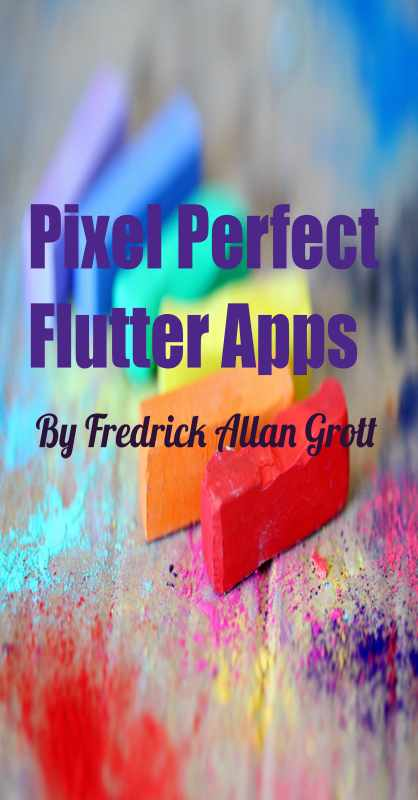

# Pixel Perfect Flutter Apps

This is the code companion repo of the book titled Pixel Perfect Flutter Apps. Repo contains a few small full apps and other chapter code flutter app demos.

## Where To Get Book

The book will be released on Gum Road in late 2023 at:

[Gum Road](https://fredgrott.gumroad.com)

## License

While the book is in fact with my commercial copyright the code in this repo is licensed as open source free for you to modify and use and re-use.

## Where I Post Free Articles

The Medium platform allows me to post free friend links to my medium articles and I post those article links on these social 
platforms:

{LinkedIN](LinkedIn https://www.linkedin.com/in/fredgrottstartupfluttermobileappdesigner/)
[Instagram](https://www.instagram.com/fredgrott/)
[Post](https://post.news/fredgrott)
[Mastadon](https://uiuxdev.social/web/@fredgrott)
[YouTube](https://www.youtube.com/c/FredGrott)

Note: If you do join medium I do in fact receive a portion of that revenue as shared membership revenue from the Medium platform.